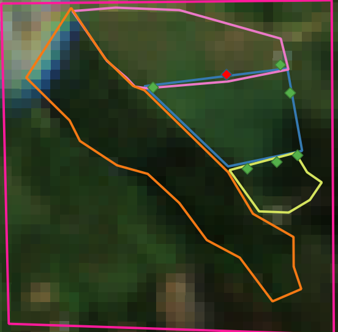
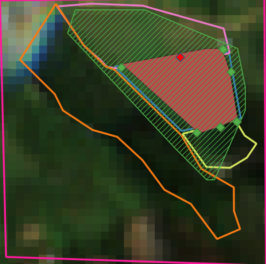

# Region Grow

Creates a polygon using a set of points from a region of interest by grouping pixels whose spectral reflectance is similar. The polygons are created using a satellite image in GeoTIFF format. In this project several algorithms are implemented to build this figure. Among them are: Selection by similarity threshold (%), Euclidean distance and selection by confidence interval. The generated polygon is exported in ESRI Shapefile format.

## Create a new polygon

Today, we are going to calculate a polygon for a sugar cane crop located in Boyaca, Colombia. The input data is a set of points near to the crop and the main goal is to find the mininum polygon which covers all the crop area only using a little number of the given examples and a satellite image. The satellite image is a 3 band raster of a Sentinel 2A scene. The bands we use are: Band 11 (Short Wave Infrared - I), Band 8 (Near Infrared) and Band 2 (Blue). The cell resolution is 10m X 10m per pixel. For band 11 we made a resampling process using a bilinear transformation.

The given points were taken at the sugar cane crop borders. Near to this crop we have other crops like yucca and corn and non crops areas like native forest. The blue area is the sugar cane area, manually delimited, we want to achieve. The pink area is the corn corp, the yellov the yucca crop and the orange area is the native forest. The green points are the points given and the red one is the first.



Finally, let's execute the algorithm to calculate this polygon. In this time, we will use the similarity threshold. This algorithm only use the first given point and expands the region scanning the 8-neighbors of the pixel. The pixel is chosen only if the refrectancy is on the +- range of reflectancy of the given point. When the the aproximately area is given. The algorithm recalculates the polygon minimizing the difference

```python
rg.execute_with_area(
    points_path=points_path,
    raster_path=raster_path,
    shape_path=shape_path,
    classifier_tag="BD",
)
```

The result is:



If you want more details see the notebook available in **examples/**

Best regards

Geovanny
