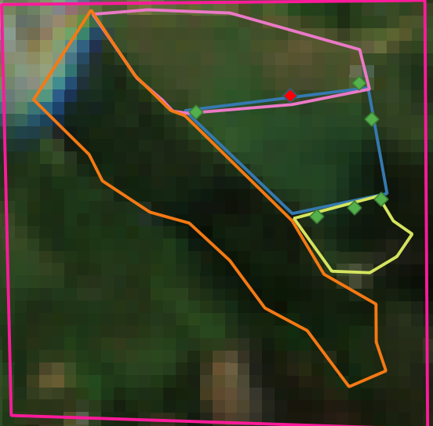
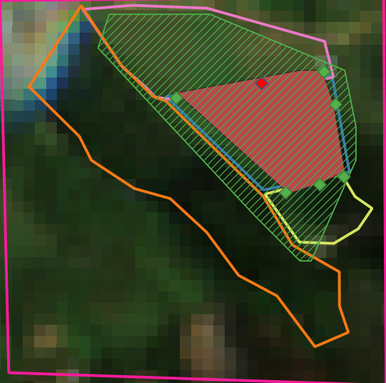

Quickstart
====================

Create a new polygon
------------------------------------------------------

Today, we are going to calculate a polygon for a sugar cane crop located
in Boyaca, Colombia. The input data is a set of points near to the crop
and the main goal is to find the mininum polygon which covers all the
crop area only using a little number of the given examples and a
satellite image. The satellite image is a 3 band raster of a Sentinel 2A
scene. The bands we use are: Band 11 (Short Wave Infrared - I), Band 8
(Near Infrared) and Band 2 (Blue). The cell resolution is 10m X 10m per
pixel. For band 11 we made a resampling process using a bilinear
transformation.

The given points were taken at the sugar cane crop borders. Near to this
crop we have other crops like yucca and corn and non crops areas like
native forest. The blue area is the sugar cane area, manually delimited,
we want to achieve. The pink area is the corn corp, the yellov the yucca
crop and the orange area is the native forest. The green points are the
points given and the red one is the first

   crop area

Now let’s see the points set given

.. code:: ipython3

    # Libraries
    import pandas as pd
    import region_grow as rg

The .csv separator **MUST** be “;” and decimal separator **MUST** be
“,”. If not, the library will fail. Also, the X coordinate column
**MUST** have the title of “LONGITUD” and the Y coordinate the title of
“LATITUD”. If you have in mind to use an aproximate area to calculate
the polygon, you have to specify this area in the column “HECTAREAS”.
The unit of measurement for the area is the hectare (ha)

.. code:: ipython3

    df = pd.read_csv("crop/crop_points.csv", sep=";", decimal=",")
    df.head(3)

.. raw:: html

    

    
    <table border="1" class="dataframe">
      <thead>
        <tr style="text-align: right;">
          <th></th>
          <th>LATITUD</th>
          <th>LONGITUD</th>
          <th>HECTAREAS</th>
        </tr>
      </thead>
      <tbody>
        <tr>
          <th>0</th>
          <td>5.804699</td>
          <td>-73.570783</td>
          <td>1.00051</td>
        </tr>
        <tr>
          <th>1</th>
          <td>5.804793</td>
          <td>-73.570280</td>
          <td>1.00051</td>
        </tr>
        <tr>
          <th>2</th>
          <td>5.804531</td>
          <td>-73.570187</td>
          <td>1.00051</td>
        </tr>
      </tbody>
    </table>
    

Finally, let’s execute the algorithm to calculate this polygon. In this
time, we will use the similarity threshold. This algorithm only use the
first given point and expands the region scanning the 8-neighbors of the
pixel. The pixel is chosen only if the refrectancy is on the +- range of
reflectancy of the given point. When the the aproximately area is given.
The algorithm recalculates the polygon minimizing the difference

.. code:: ipython3

    shape_path = "crop/example.shp"
    raster_path = "crop/A_crop.tif"
    points_path = "crop/crop_points.csv"

.. code:: ipython3

    rg.execute_with_area(
        points_path=points_path,
        raster_path=raster_path,
        shape_path=shape_path,
        classifier_tag="BD",    
    )

.. parsed-literal::

    WARNING:root:[BandThreshold - Classifier] ATENCION: El conjunto de datos de pixeles semilla tiene mas de 1 registro, solo se utilizara el primero. 
    Por favor considere ejecutar de nuevo este algoritmo pasando en el .csv unicamente las coordenadas del punto de interes
    
    WARNING:root:[BandThreshold - Classifier] ATENCION: El conjunto de datos de pixeles semilla tiene mas de 1 registro, solo se utilizara el primero. 
    Por favor considere ejecutar de nuevo este algoritmo pasando en el .csv unicamente las coordenadas del punto de interes
    

.. warning::
    Above, a warning message has been shown indicating that only the first
    point of the dataset will be use. The last because the dataset had more
    than one element. To conclude, let’s see the result polygon

   crop area

The red polygon was the generated one, it fills almost all the expected
region ! Moreover, the green line polygon was created using spectral
indexes EVI, ARVI and GNDVI and it gives an interesting result too,
grouping all crops in the scene.

If you want more details about the decisions i made to find the best
method to fit new polygons and why i chose this band combination, let me
invite you to read my article which will be available in this
repository.

Thank you so much for reading and hope this project will be usefull for
you

Best regards

Geovanny
